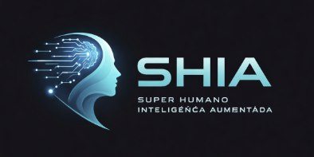

<p align="center">
  
</p>

<h1 align="center">🧠 SHIA - Super Humanos Inteligência Aumentada</h1>

<p align="center">
  <strong>Talento Humano + IA = Escala, Autonomia e Resultado</strong>
</p>

<p align="center">
  <a href="#-sobre-o-curso">Sobre</a> •
  <a href="#-trilhas">Trilhas</a> •
  <a href="#-estrutura">Estrutura</a> •
  <a href="#-tecnologias">Tecnologias</a> •
  <a href="#-começando">Começando</a>
</p>

<p align="center">
  
  
  
  
</p>

---

## 🎯 Sobre o Curso

> **"A Inteligência Artificial não substitui o talento humano, ela o AMPLIFICA."**

O **SHIA** é um curso completo de **Inteligência Aumentada** que ensina você a usar IA como amplificadora do seu talento, não como substituta.

A IA elimina barreiras técnicas, estruturas caras e dependência de equipes grandes, permitindo que qualquer pessoa com uma ideia clara possa transformá-la em realidade.

### ✨ O que você vai aprender

| Competência | Descrição |
|-------------|-----------|
| 🎯 **Autonomia** | Usar ferramentas de IA de forma independente |
| 💡 **Clareza** | Traduzir ideias em prompts efetivos |
| ⚡ **Velocidade** | Executar projetos criativos e técnicos rapidamente |
| 📈 **Escala** | Multiplicar impacto sem aumentar custos |
| 🔥 **Confiança** | Aplicar IA em qualquer contexto profissional |

---

## 🗺️ Trilhas

O curso é dividido em **4 trilhas progressivas**, cada uma com foco específico:

<table>
<tr>
<td width="25%" align="center">

### 🟡 Trilha 0
**INTRODUÇÃO**

Fundamentos de IA e Engenharia de Prompts

*Obrigatória para todos*

`10 módulos`

</td>
<td width="25%" align="center">

### 🟢 Trilha 1
**ARTE**

Expressão criativa e produção multimídia com IA

*Para artistas e criadores*

`10 módulos`

</td>
<td width="25%" align="center">

### 🔵 Trilha 2
**ENGENHARIA**

Lógica, automação e soluções técnicas com IA

*Para desenvolvedores*

`10 módulos`

</td>
<td width="25%" align="center">

### 🟣 Trilha 3
**CONSULTORIA**

Diagnóstico, estratégia e escala de negócios

*Para consultores*

`10 módulos`

</td>
</tr>
</table>

---

## 📚 Estrutura do Curso

### Trilha 0: Introdução (Obrigatória)

| # | Módulo | Descrição |
|---|--------|-----------|
| 1 | 🚀 Bem-vindo à Revolução da IA | O que é Inteligência Aumentada e por que ela é a verdadeira revolução |
| 2 | 🎯 A Essência da Engenharia de Prompts | A arte de conversar com a IA |
| 3 | 🛠️ Ferramentas e Modelos de IA | GPT-4, Claude, Gemini, Midjourney e mais |
| 4 | 📐 Anatomia de um Prompt Perfeito | Estrutura e elementos-chave |
| 5 | 🎓 Zero-Shot e Few-Shot Prompting | Aprendendo com poucos exemplos |
| 6 | 🧪 O Mindset da Experimentação | Como iterar e refinar seus prompts |
| 7 | 🎨 Além do Texto | Geração de imagens, áudio e código |
| 8 | ⚖️ Ética e Responsabilidade | Uso responsável da IA |
| 9 | 📖 Como Aprender a Aprender | Habilidades do futuro |
| 10 | 🏆 Projeto Final Integrado | Aplicação prática |

### Trilha 1: Arte

| # | Módulo | Foco |
|---|--------|------|
| 1 | A Nova Definição de Artista | Redefinir o papel do artista na era digital |
| 2 | Traduzindo Intenção em Prompts | Comunicar ideias criativas para a IA |
| 3 | Criação Multimídia Sem Barreiras | Produzir música, cinema e arte |
| 4 | Desenvolvendo um Estilo Único | Criar identidade visual consistente |
| 5 | Narrativas Visuais e Storytelling | Contar histórias através de imagens |
| 6 | Ferramentas Avançadas de Geração | Dominar ferramentas profissionais |
| 7 | Da Geração à Pós-Produção | Refinar e finalizar obras |
| 8 | Arte com Propósito | Aplicar arte para impacto real |
| 9 | Monetização e Audiência | Transformar arte em renda |
| 10 | O Futuro da Criatividade | Refletir sobre o futuro |

### Trilha 2: Engenharia

| # | Módulo | Foco |
|---|--------|------|
| 1 | Mindset do Engenheiro Aumentado | Desenvolver mentalidade de resultado (ROI) |
| 2 | Diagnóstico Lógico com IA | Usar IA como parceira de raciocínio |
| 3 | Prototipagem Rápida e Vibe Code | Criar soluções funcionais rapidamente |
| 4 | Automação de Processos | Automatizar tarefas repetitivas |
| 5 | RAG na Prática | Integrar conhecimento externo à IA |
| 6 | Construindo Agentes de IA | Criar assistentes autônomos |
| 7 | Técnicas Avançadas de Prompt | Aplicar CoT, ToT, MoE |
| 8 | Medição e Melhoria Contínua | Medir e otimizar resultados |
| 9 | Integração em Aplicações Reais | Implementar IA em sistemas |
| 10 | Gestão de Projetos de IA | Escalar soluções |

### Trilha 3: Consultoria

| # | Módulo | Foco |
|---|--------|------|
| 1 | O Novo Papel do Consultor | Redefinir o papel na era da IA |
| 2 | Diagnóstico Inteligente | Mapear problemas com IA |
| 3 | Mapeamento de Oportunidades | Identificar onde IA gera ganho |
| 4 | Estratégias Personalizadas | Criar soluções sob medida |
| 5 | Potencializando Equipes | Empoderar pessoas |
| 6 | Formatos de Entrega | Estruturar mentorias e workshops |
| 7 | Biblioteca de Prompts | Criar ativos reutilizáveis |
| 8 | Escala com Automação | Escalar sem perder o humano |
| 9 | Medindo ROI | Demonstrar resultados tangíveis |
| 10 | Ética e Governança | Liderar com responsabilidade |

---

## 🛠️ Tecnologias Abordadas

### Modelos de Linguagem (LLMs)

| Modelo | Empresa | Pontos Fortes |
|--------|---------|---------------|
| GPT-4 | OpenAI | Versatilidade, raciocínio complexo |
| Claude | Anthropic | Contexto longo, segurança |
| Gemini | Google | Multimodalidade, integração |
| Llama | Meta | Open source, customização |

### Ferramentas Criativas

| Categoria | Ferramentas |
|-----------|-------------|
| **Imagem** | Midjourney, DALL-E 3, Stable Diffusion, Leonardo.ai |
| **Áudio** | ElevenLabs, Suno, Whisper |
| **Vídeo** | Runway, Pika Labs, Sora |
| **Código** | GitHub Copilot, Cursor, Replit AI |

### Automação e Integração

| Categoria | Ferramentas |
|-----------|-------------|
| **No-Code** | Zapier, Make, n8n |
| **Frameworks** | LangChain, LlamaIndex |
| **Produtividade** | Notion AI, Zapier AI |

---

## 🚀 Começando

### Pré-requisitos

- Navegador moderno (Chrome, Firefox, Safari, Edge)
- Conexão com internet
- Vontade de aprender! 🔥

### Acessar o Curso

```bash
# Clone o repositório
git clone https://github.com/inematds/SHIA.git

# Entre na pasta
cd SHIA

# Abra o curso no navegador
open curso/index.html
# ou
xdg-open curso/index.html  # Linux
```

---

## 📁 Estrutura do Projeto

```
SHIA/
├── 📄 README.md              # Este arquivo
├── 📁 curso/                 # Páginas do curso
│   ├── index.html           # Página inicial
│   ├── trilha0/             # Trilha de Introdução
│   ├── trilha1/             # Trilha de Arte
│   ├── trilha2/             # Trilha de Engenharia
│   └── trilha3/             # Trilha de Consultoria
├── 📁 doc/                   # Documentação
│   ├── CURSO_SHIA_COMPLETO.md
│   ├── base/                # Conteúdo base
│   └── conteudo_modulos/    # Módulos detalhados
├── 📁 ref/                   # Referências de design
└── 📁 .bmad-core/           # Framework BMad Method
```

---

## 🎨 Sistema de Cores

| Trilha | Cor | Código | Uso |
|--------|-----|--------|-----|
| **Trilha 0** | Amarelo | `#EAB308` | Introdução/Fundamentos |
| **Trilha 1** | Verde | `#10B981` | Arte |
| **Trilha 2** | Azul | `#3B82F6` | Engenharia |
| **Trilha 3** | Roxo | `#8B5CF6` | Consultoria |

---

## 📖 Metodologia

O curso utiliza uma metodologia baseada em:

- **12 Práticas de Design Instrucional** (University of San Diego)
- **10 Fases de Aprendizagem Transformacional** (Mezirow)
- **3 Estágios Centrais:** Crise Pessoal → Reflexão → Ação

### Estrutura de Cada Tópico

1. **Explicação Detalhada** - Conceito teórico aprofundado
2. **Exemplos Práticos de Prompts** - Aplicação imediata
3. **Exercícios** - Prática guiada
4. **Recursos Visuais** - Infográficos, diagramas, imagens

---

## 🤝 Contribuindo

Contribuições são bem-vindas! Sinta-se à vontade para:

1. Fazer um Fork do projeto
2. Criar uma Branch (`git checkout -b feature/NovaFuncionalidade`)
3. Commit suas mudanças (`git commit -m 'Adiciona nova funcionalidade'`)
4. Push para a Branch (`git push origin feature/NovaFuncionalidade`)
5. Abrir um Pull Request

---

## 📜 Licença

Este projeto está sob a licença MIT. Veja o arquivo [LICENSE](LICENSE) para mais detalhes.

---

## 📬 Contato

- **GitHub:** [@inematds](https://github.com/inematds)
- **Email:** inematds@gmail.com

---

<p align="center">
  <strong>IA não pensa por você. IA AMPLIFICA quem você é.</strong>
</p>

<p align="center">
  Feito com 🧠 e ❤️ pelo time SHIA
</p>
